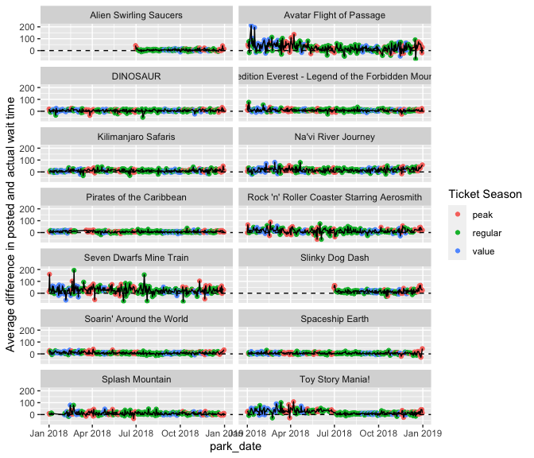

<!-- README.md is generated from README.Rmd. Please edit that file -->

# touringplans

<!-- badges: start -->
<!-- badges: end -->

The goal of touringplans is to provide access to Disney World Ride Wait
Time Datasets curated by the
[TouringPlans.com](https://touringplans.com) team.

## Installation

<!-- You can install the released version of touringplans from [CRAN](https://CRAN.R-project.org) with: -->
<!-- ``` r -->
<!-- install.packages("touringplans") -->
<!-- ``` -->

You can install the development version of touringplans with:

``` r
devtools::install_github("LucyMcGowan/touringplans")
```

You can find a list of all data sets along with variable information on
[the touringplans package
website](https://lucymcgowan.github.io/touringplans)

## Example

The `touringplans_2018` data frame contains wait time data aggregated by
hour for 14 attractions, along with some park-level daily metadata. The
example below demonstrates how wait times by day are associated with the
Ticket Season. The example below uses the tidyverse package to assist
with data wrangling.

``` r
library(touringplans)
library(tidyverse)
touringplans_2018 %>%
  count(attraction_name)
#> # A tibble: 14 × 2
#>    attraction_name                                           n
#>    <chr>                                                 <int>
#>  1 Alien Swirling Saucers                                 2718
#>  2 Avatar Flight of Passage                               5147
#>  3 DINOSAUR                                               4884
#>  4 Expedition Everest - Legend of the Forbidden Mountain  4950
#>  5 Kilimanjaro Safaris                                    4887
#>  6 Na'vi River Journey                                    5073
#>  7 Pirates of the Caribbean                               5168
#>  8 Rock 'n' Roller Coaster Starring Aerosmith             5062
#>  9 Seven Dwarfs Mine Train                                5622
#> 10 Slinky Dog Dash                                        2691
#> 11 Soarin' Around the World                               5203
#> 12 Spaceship Earth                                        5078
#> 13 Splash Mountain                                        4964
#> 14 Toy Story Mania!                                       5045
```

We can aggregate the hourly posted wait time data into an avarage wait
time by day for each ride.

``` r
agg_2018 <- touringplans_2018 %>%
  group_by(park_date, attraction_name, park_ticket_season) %>%
  summarise(average_diff = mean(wait_minutes_posted_avg - wait_minutes_actual_avg, na.rm = TRUE), .groups = "drop") %>%
  filter(average_diff > -300) # remove weird data points (more on this later!)
```

On average, Disney over predicts wait times by 15 and a half minutes per
day on the 14 rides included in this dataset during peak season, around
11 and a half minutes per day during regular season, and around 13
minutes per day during value season.

``` r
lm(average_diff ~ park_ticket_season, data = agg_2018) %>%
  summary()
#> 
#> Call:
#> lm(formula = average_diff ~ park_ticket_season, data = agg_2018)
#> 
#> Residuals:
#>     Min      1Q  Median      3Q     Max 
#> -82.401  -8.734  -3.066   5.487 198.772 
#> 
#> Coefficients:
#>                           Estimate Std. Error t value Pr(>|t|)    
#> (Intercept)                15.6420     0.6006  26.045  < 2e-16 ***
#> park_ticket_seasonregular  -3.9076     0.7074  -5.524 3.53e-08 ***
#> park_ticket_seasonvalue    -2.4144     0.8378  -2.882  0.00397 ** 
#> ---
#> Signif. codes:  0 '***' 0.001 '**' 0.01 '*' 0.05 '.' 0.1 ' ' 1
#> 
#> Residual standard error: 17.57 on 3967 degrees of freedom
#> Multiple R-squared:  0.007723,   Adjusted R-squared:  0.007223 
#> F-statistic: 15.44 on 2 and 3967 DF,  p-value: 2.095e-07
```

``` r
ggplot(agg_2018, aes(x = park_date, y = average_diff)) +
  geom_point(aes(color = park_ticket_season)) +
  geom_line() +
  geom_hline(yintercept = 0, lty = 2) +
  facet_wrap(~ attraction_name, ncol = 2) + 
  labs(y = "Average difference in posted and actual wait time",
       color = "Ticket Season")
```

 We
can see that there are some attractions that this holds true for moreso
than others.

``` r
library(ggridges)

ggplot(agg_2018, aes(x = average_diff, y = park_ticket_season, fill = park_ticket_season)) +
  geom_density_ridges() +
  geom_vline(xintercept = 0, lty = 2) +
  xlim(c(-30, 50)) +
  facet_wrap(~ attraction_name, ncol = 3) + 
  labs(x = "Average difference in posted and actual wait time",
       fill = "Ticket Season",
       y = "Ticket Season")
```


