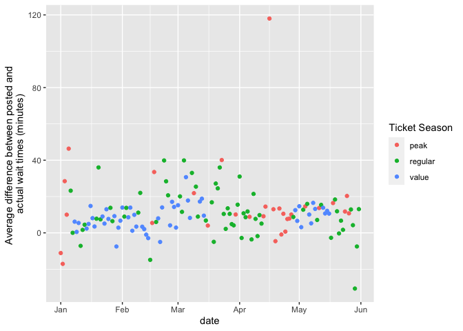

<!-- README.md is generated from README.Rmd. Please edit that file -->

# touringplans

<!-- badges: start -->
<!-- badges: end -->

The goal of touringplans is to provide access to Disney World Ride Wait
Time Datasets curated by the TouringPlans.com team.

## Installation

<!-- You can install the released version of touringplans from [CRAN](https://CRAN.R-project.org) with: -->
<!-- ``` r -->
<!-- install.packages("touringplans") -->
<!-- ``` -->

You can install the development version of touringplans with:

``` r
devtools::install_github("LucyMcGowan/touringplans")
#> Skipping install of 'touringplans' from a github remote, the SHA1 (84319908) has not changed since last install.
#>   Use `force = TRUE` to force installation
```

## Example

For example, the following code looks at the Toy Story Mania! posted and
actual wait times. We look at the difference in average posted and
actual wait times within each hour in January - May 2019, then average
these across days and plot them.

``` r
library(touringplans)
library(tidyverse)
#> ── Attaching packages ─────────────────────────────────────── tidyverse 1.3.0 ──
#> ✓ ggplot2 3.3.4     ✓ purrr   0.3.4
#> ✓ tibble  3.1.4     ✓ dplyr   1.0.5
#> ✓ tidyr   1.1.2     ✓ stringr 1.4.0
#> ✓ readr   1.4.0     ✓ forcats 0.5.1
#> ── Conflicts ────────────────────────────────────────── tidyverse_conflicts() ──
#> x dplyr::filter() masks stats::filter()
#> x dplyr::lag()    masks stats::lag()

toy_story_mania %>%
  filter(date >= as.Date("2019-01-01"), date <= as.Date("2019-05-31")) %>%
  mutate(hour = lubridate::hour(datetime)) %>%
  group_by(date, hour) %>%
  summarise(avg_post = mean(spostmin, na.rm = TRUE),
            avg_act = mean(sactmin, na.rm = TRUE),
            diff = avg_post - avg_act, .groups = "drop") %>%
  group_by(date) %>%
  summarise(m = mean(diff, na.rm = TRUE)) -> toy_story_summary
ggplot(toy_story_summary, aes(x = date, y = m)) + 
  geom_point() +
  labs(y = "Average difference between posted and \nactual wait times (minutes)")
#> Warning: Removed 4 rows containing missing values (geom_point).
```


The `touringplans_metadata` is a data frame that contains metadata about
the parks. This can be merged with the individual ride datasets. For
example, the code below demonstrates how to merge the metadata with the
`toy_story_summary` data curated above and recreate the plot, colored by
ticket season.

``` r
toy_story_summary %>%
  left_join(touringplans_metadata, by = "date") %>%
  ggplot(aes(x = date, y = m, color = wdw_ticket_season)) + 
  geom_point() +
  labs(y = "Average difference between posted and \nactual wait times (minutes)", 
       color = "Ticket Season") 
#> Warning: Removed 4 rows containing missing values (geom_point).
```


